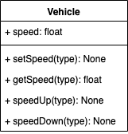
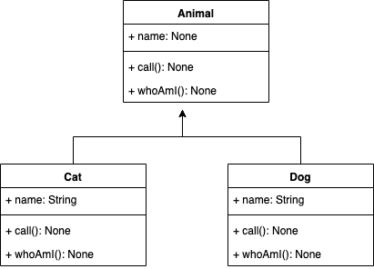

# Assignment

## Problem 1

Design a class named `Vehicle`, you need to implement these methods `speedUp()`,`speedDown()`,`getSpeed()`,`setSpeed(speed)`



We will test your code with this code.

```Python
if __name__ == "__main__":
    vehicle = Vehicle()
    vehicle.setSpeed(60)
    print(f"Speed currently is {vehicle.getSpeed()}")
    vehicle.speedUp()
    vehicle.speedUp()
    vehicle.speedDown()
```

The expected output is blow.

```bash
Speed currently is 60
We are speeding up, now our speed is 70
We are speeding up, now our speed is 80
We are speeding down, now our speed is 70
```

## Problem 2

Design a parent class `Animal`, then design two child class `Cat` and `Dog`, each classes has two method `call()` and `whatAmI()`



We will test your code with this code.

```Python
if __name__ == "__main__":
    dog = Dog()
    dog.call()
    dog.whoAmI()
    print("===============")

    cat = Cat()
    cat.call()
    cat.whoAmI()

```

The expected output is blow.

```bash
Bark!
I am a Dog
===============
Meow!
```